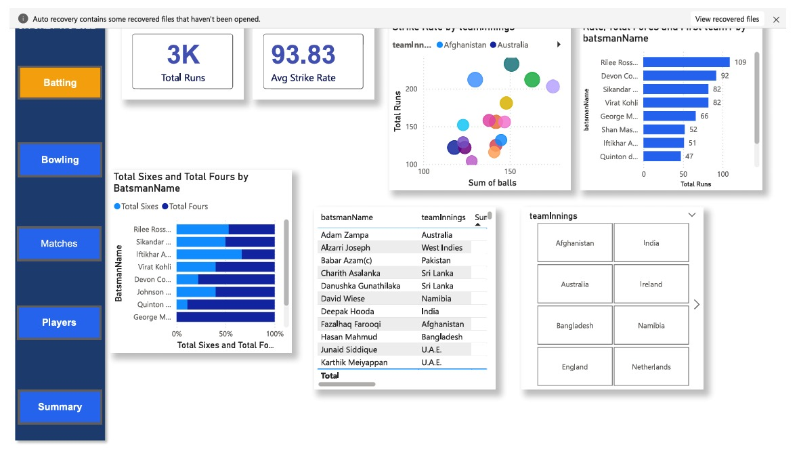
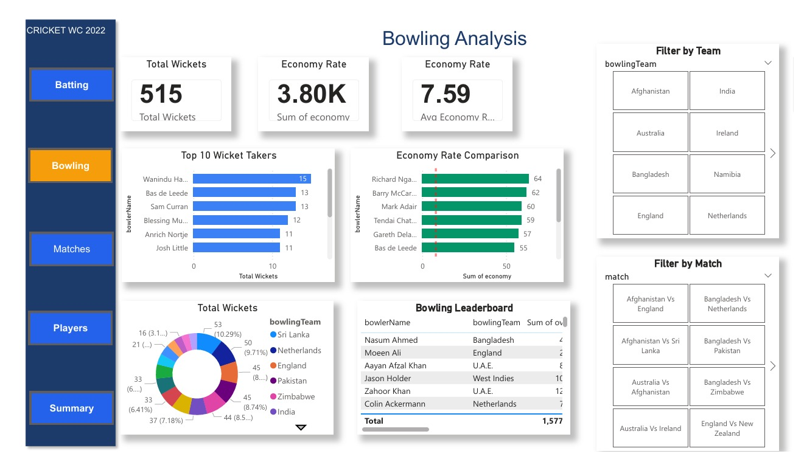
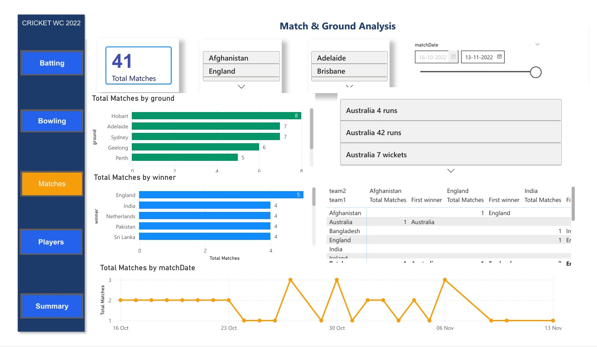
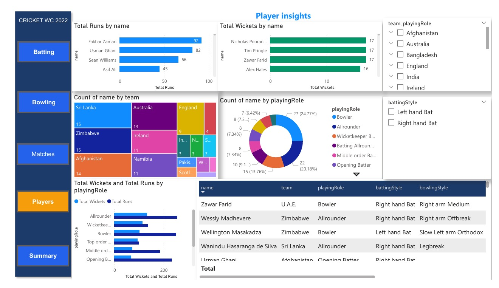
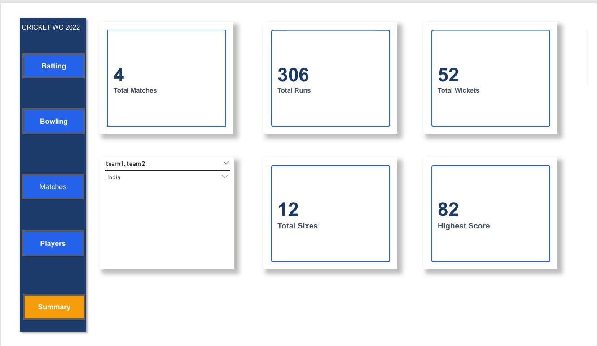

# T20 World Cup 2022 Analysis Dashboard

# Overview
This dashboard includes an analysis of the ICC T20 World Cup 2022 data, which includes insights on player statistics related to batting, bowling, match outcomes, and venues where the games were played. 

# Tools
- Power BI
- Power Query
- Data Analysis Expressions (DAX)
- JavaScript Object Notation (JSON)
- Data Visualization Software 

 Insight
- Players with the most runs scored
- Players who took the most wickets
- Understand how matches were played and the grounds used
- Provide player statistics based on their gameplay

# Deliverables
- Power BI Dashboard (.pbix)
- Power BI Dashboard PDF Report
- Power BI Dashboard Data Set (JSON)
- Power BI Dashboard Screenshots

## Dashboard Screenshots

### Batting Analysis

### Bowling Analysis

### Match & Ground Analysis

### Player Insights

### Summary Dashboard

